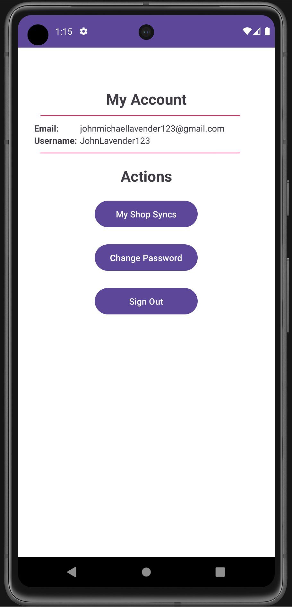

# ShopSync - Shared Shopping App

## Welcome to ShopSync!

ShopSync is an Android app designed to streamline shared shopping experiences among roommates. With
ShopSync, you can easily collaborate with your housemates to manage shared shopping lists, track
purchases, and settle expenses in a fair and transparent manner.
Features

### User Authentication

Users can register and log in to the app securely.
Logging out is also possible to ensure privacy.

### Shared Shopping List

The shopping list is accessible to all participating roommates within a specific apartment or
household.
Roommates can add items to the shared shopping list, making it a convenient hub for tracking
communal needs.

### Purchase Tracking

Roommates shopping in stores can mark items as purchased, entering the item's price and moving it to
the "recently purchased" list.
Alternatively, multiple items can be selected, marked as purchased, and moved collectively to the "
recently purchased" list with a total price.

### Cost Settlement

Roommates can initiate a cost settlement, triggering the computation of:

- Total cost of purchases in the apartment/household.
- Average cost per roommate (total cost divided by the number of roommates).
- Total cost by roommate (money spent for purchases by each roommate).

The "recently purchased" list is cleared after settling the cost.
Optionally, the app may compute amounts that each roommate owes or is owed, simplifying expense
reconciliation.

### Getting Started

To get started with ShopSync, follow these steps:

Download and Install the App: Visit the Google Play Store and download ShopSync.
Register/Login: Create an account or log in to your existing account.
Create or Join a Household: Start a new shared shopping group or join an existing one.
Add Items to the Shopping List: Collaboratively build your shopping list with your roommates.
Track Purchases: When shopping, mark items as purchased and record their prices.
Settle Costs: Periodically settle costs to ensure fair expense distribution among roommates.

    
    
    
    
    
    

### Technologies Used

ShopSync leverages the power of Google Firebase to provide a reliable and real-time data-sharing
infrastructure, ensuring seamless collaboration among roommates.
Feedback

Happy shopping and syncing!